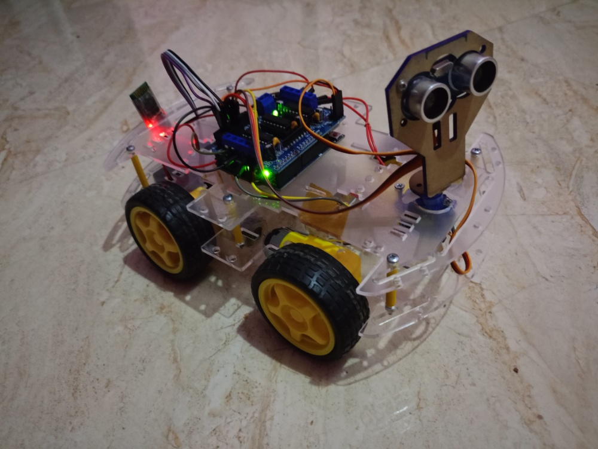
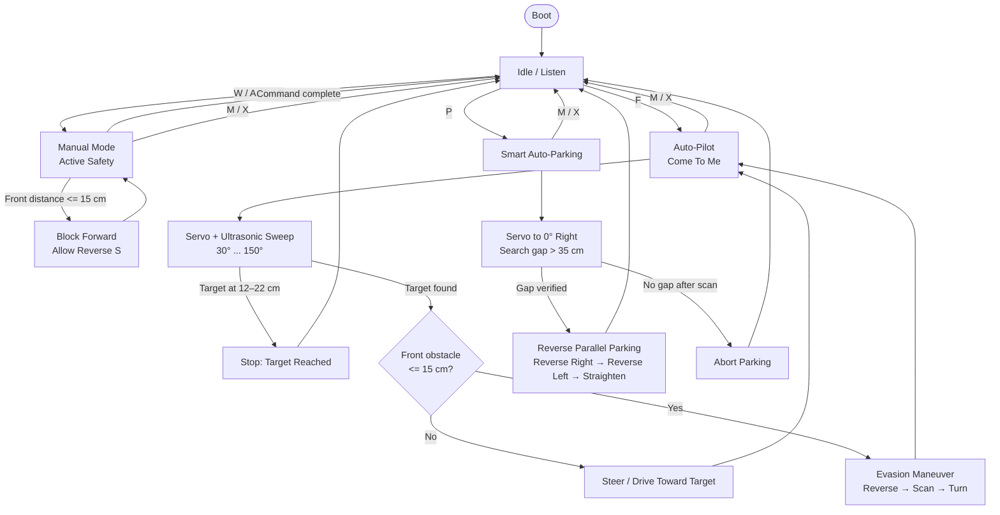

# Smart Autonomous Mini-Rover



> A compact Arduino Uno rover with Bluetooth manual control, active obstacle safety, target tracking, and reverse parallel auto-parking.

[](https://docs.arduino.cc/hardware/uno-rev3)
[](https://www.arduino.cc/)
[](LICENSE)

## Overview

The **Smart Autonomous Mini-Rover** is a four-wheel differential-drive platform built around an Arduino Uno and an L293D Motor Drive Shield V1. It combines a simple Bluetooth command protocol with bounded ultrasonic sensing and servo-based environmental scanning:

- **Manual mode with active safety:** drive from a phone or Bluetooth terminal using `W`, `A`, `S`, and `D`. Forward motion is blocked when an obstacle is at or below **15 cm**, while reverse remains available as an escape path.
- **Auto-Pilot / “Come To Me”:** press `F` to scan from **30° to 150°**, identify the nearest valid target, steer toward it, avoid dynamic obstacles, and stop inside the **12–22 cm** target-distance window.
- **Smart auto-parking:** press `P` to scan to the right, search for a gap greater than **35 cm**, verify it, and perform a timed reverse-parallel sequence: **Reverse Right → Reverse Left → Straighten**.

The implementation is intentionally compact and suitable for an Arduino Uno, while keeping hardware mapping, movement primitives, and high-level behaviors easy to extend.

## Feature Highlights

### Zero-Blocking safety path

The ultrasonic measurement uses a **25 ms `pulseIn()` timeout**. A missing echo is treated as an out-of-range reading rather than waiting forever, preventing a disconnected or poorly aligned sensor from holding the control loop indefinitely. Manual forward commands are checked against the 15 cm safety threshold before motors are driven.

> **Implementation note:** autonomous scan and parking maneuvers use short, deterministic timing delays to make the rover’s motion repeatable. The sensor-read path is bounded, but the current maneuver routines are not a fully interrupt-driven/non-blocking scheduler.

### Evasion Maneuver

When Auto-Pilot encounters an obstacle at or below 15 cm, the rover:

1. Stops and reports the event over Bluetooth.
2. Reverses briefly to create clearance.
3. Scans right at 30° and left at 150°.
4. Turns toward the side with the clearer path.
5. Returns to target tracking.

## System Architecture

The firmware follows a small state machine. Boot initializes the pins, servo, Bluetooth link, and motor release state; the rover then waits for commands in **Idle / Listen**. `F` enters target tracking, `P` runs the parking routine, and `W/A/S/D` remain in manual control. `M` or `X` cancels autonomous behavior and returns to manual control.



## Hardware

| Component | Quantity | Purpose |
|---|---:|---|
| Arduino Uno | 1 | Main controller |
| L293D Motor Drive Shield V1 | 1 | Four-channel DC motor driver |
| DC geared motors | 4 | Differential-drive locomotion on M1–M4 |
| HC-05 Bluetooth module | 1 | Wireless command and status link |
| HC-SR04 ultrasonic sensor | 1 | Distance measurement and environment scanning |
| SG90 micro servo | 1 | Rotates the ultrasonic sensor for scanning |
| External battery pack | 1 | Motor/shield supply through `EXT_PWR` |

## Wiring and Pinout

### Motor shield connections

| Device | Shield connection | Notes |
|---|---|---|
| Front-left DC motor | `M1` | Controlled by `AF_DCMotor motor1(1)` |
| Rear-left DC motor | `M2` | Controlled by `AF_DCMotor motor2(2)` |
| Rear-right DC motor | `M3` | Controlled by `AF_DCMotor motor3(3)` |
| Front-right DC motor | `M4` | Controlled by `AF_DCMotor motor4(4)` |
| SG90 signal | `SER1` / Arduino D10 | Servo is attached to pin 10 in firmware |
| Motor battery positive/negative | `EXT_PWR` | Keep the shield power jumper **ON** for the documented power arrangement |

### Sensor and communication connections

| Module | Module pin | Arduino / shield pin | Firmware mapping |
|---|---|---|---|
| HC-SR04 | `VCC` | `5V` | — |
| HC-SR04 | `GND` | `GND` | — |
| HC-SR04 | `Trig` | `A0` | `TRIG_PIN` |
| HC-SR04 | `Echo` | `A1` | `ECHO_PIN` |
| HC-05 | `VCC` | `5V` | — |
| HC-05 | `GND` | `GND` | — |
| HC-05 | `TX` | `A2` | SoftwareSerial RX |
| HC-05 | `RX` | `A3` | SoftwareSerial TX |
| SG90 | Signal | `SER1` / D10 | `radarServo.attach(10)` |

**HC-05 voltage caution:** the HC-05 module is typically powered from 5 V breakout-board input, but its UART `RX` input may be 3.3 V logic. Use an appropriate level shifter or resistor divider from Arduino `A3` to the module `RX` where required by your breakout board. Confirm the pin labels on the exact HC-05 board before powering it.

**Power caution:** motor current can cause voltage dips and electrical noise. Use a battery pack appropriate for the motors and shield, keep grounds common, and test with the wheels raised before placing the rover on the floor. Do not connect a motor battery to the Arduino 5 V pin.

## Bluetooth Command Protocol

Commands are case-insensitive. The sketch listens at **9600 baud** and sends human-readable status messages back over the same Bluetooth link.

| Command | Mode / action | Behavior |
|---|---|---|
| `W` | Manual forward | Drives forward only when the front distance is greater than 15 cm |
| `S` | Manual reverse | Reverses, including when forward movement is safety-blocked |
| `A` | Manual left | Timed left turn, then stop |
| `D` | Manual right | Timed right turn, then stop |
| `F` | Auto-Pilot | Enables target tracking / “Come To Me” |
| `P` | Smart auto-parking | Searches for and executes a reverse-parallel parking maneuver |
| `M` or `X` | Manual override | Cancels Auto-Pilot or parking and stops the rover |
| `C` | Continuous right | Turns right until another command changes the motor state |
| `Z` | Continuous left | Turns left until another command changes the motor state |
| `1` | Speed preset | Sets speed to 130 |
| `2` | Speed preset | Sets speed to 190 |
| `3` | Speed preset | Sets speed to 255 |

Typical status messages include:

- `System Booted. Awaiting Telemetry Commands.`
- `WARNING: Obstacle Ahead! Forward Blocked.`
- `STATUS: Target Tracking Engaged.`
- `STATUS: Obstacle detected! Executing evasion maneuver...`
- `STATUS: Auto-Parking successfully completed!`

## Firmware Behavior

### Manual mode

`moveForward()` centers the radar servo, reads the HC-SR04, and refuses to drive forward when the measured distance is between 0 and 15 cm inclusive. `moveBackward()` does not use this forward interlock so the operator can back away from an obstacle. The `A` and `D` commands are short tap turns; `C` and `Z` provide continuous turning.

### Auto-Pilot: “Come To Me”

The target-tracking routine performs the following cycle:

1. Check the forward path.
2. If blocked, run the **Evasion Maneuver**.
3. Sweep the servo through 30°, 60°, 90°, 120°, and 150°.
4. Select the nearest reading greater than 5 cm.
5. Stop when the nearest target is within 12–22 cm.
6. Search again if the target is beyond 150 cm.
7. Turn toward the target when it is off-center; otherwise advance in short bursts.

### Smart auto-parking

The parking routine points the sensor to 0° (right), advances in controlled increments, and looks for a side reading greater than 35 cm. A candidate opening is advanced into and checked again before it is accepted. Once verified, the rover performs the timed sequence:

1. Align forward.
2. Reverse right.
3. Reverse left to straighten.
4. Center the chassis and stop.

The timing constants are chassis-dependent. If your rover pivots differently, tune the `delay()` values in `executeSmartAutoParking()` after validating motor direction and wheel geometry.

## Software Setup

### Arduino IDE

1. Install the [Arduino IDE](https://www.arduino.cc/en/software).
2. Select **Arduino Uno** under **Tools → Board**.
3. Install these libraries through **Sketch → Include Library → Manage Libraries**:
   - **Adafruit Motor Shield library** (the V1 `AFMotor.h` library)
   - **Servo** (normally bundled with the Arduino AVR core)
   - **SoftwareSerial** (normally bundled with the Arduino AVR core)
4. Open `Smart_Rover.ino`.
5. Select the correct serial port and compile.
6. Upload with the rover’s motor power disconnected or wheels raised where practical.
7. Open a Bluetooth terminal at **9600 baud**, pair with the HC-05, and send commands from the protocol table.

> The shield library must match the V1 L293D shield API used by this sketch (`AF_DCMotor`, `FORWARD`, `BACKWARD`, and `RELEASE`). Newer motor-shield libraries for other shield revisions may use a different API.

## Repository Layout

```text
Smart-Autonomous-Mini-Rover/
├── Smart_Rover.ino       # Arduino Uno firmware
├── README.md             # Hardware, software, and behavior documentation
├── CONTRIBUTING.md       # Contribution and safety checklist
├── LICENSE               # MIT license
├── .gitignore            # Arduino/editor build exclusions
└── assets/
    └── 1003320718.jpg    # Project hero image
```

## Calibration and Bring-Up Checklist

- [ ] Verify all grounds are common before connecting power.
- [ ] Confirm each motor’s physical direction; swap motor leads if a wheel runs opposite to the intended side.
- [ ] Confirm `SER1` really maps to D10 on the installed shield revision.
- [ ] Test the ultrasonic sensor at center position before testing a sweep.
- [ ] Pair with HC-05 and confirm the boot message at 9600 baud.
- [ ] Test `W` with the wheels raised, then place an object within 15 cm and verify forward blocking.
- [ ] Verify `S` still reverses while forward motion is blocked.
- [ ] Test Auto-Pilot in a large, open, low-speed area.
- [ ] Tune parking delays and thresholds for the chassis, wheelbase, battery voltage, and floor surface.

## Safety and Limitations

- This is an experimental hobby platform, not a certified safety system.
- The 15 cm interlock protects only the commanded forward movement and depends on a valid HC-SR04 reading.
- Ultrasonic sensors can miss soft, angled, narrow, or rapidly moving objects.
- Bluetooth commands are unauthenticated; anyone within radio range may be able to control the rover.
- The timed parking maneuver assumes consistent motor output and a reasonably flat surface.
- Always keep a manual override available, test with a raised chassis first, and remove motor power before changing wiring.

## License

Released under the [MIT License](LICENSE).
